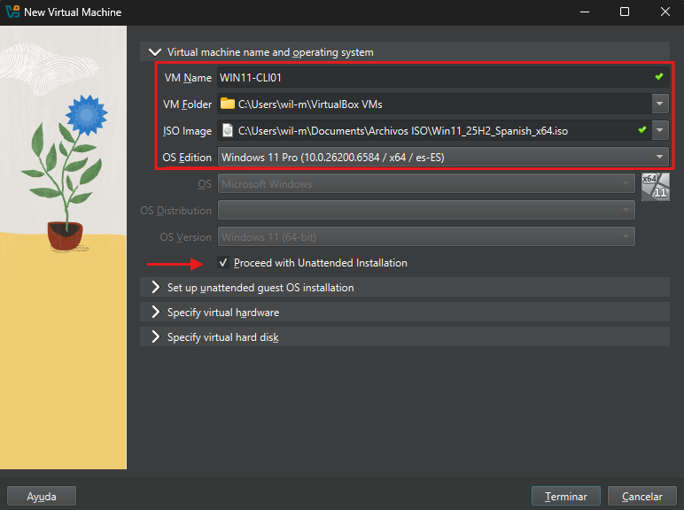
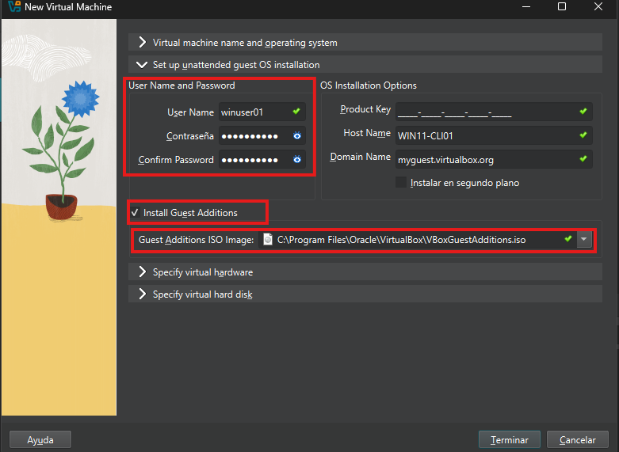
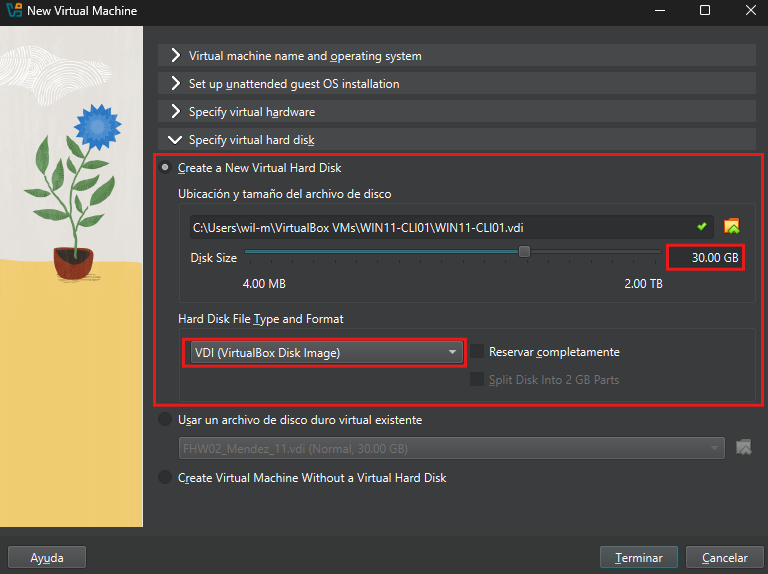

# Windows 11 Pro
## Descripción
Implementación de una máquina virtual Windows 11 Pro dentro del laboratorio ASIR utilizando Oracle VirtualBox.

Esta máquina actua como cliente dentro de la infraestructura corporativa y será utilizada para realizar pruebas de dominio, autenticación mediante Active Directory, acceso a recursos compartidos, aplicación de GPO y validación de servicios de red.

## Obejtivos 
* Desplegar un sistema Windows 11 funcional.
* Preparar un cliente para futuras prácticas de active Directory.
* Validar el funcionamiento del entorno virtualizado.
* Configurar una estación de trabajo empresarial.

## Tecnologías Utilizadas
* Oracle VirtualBox
* Windows 11 Pro 24H2
* VirtualBox Guest Additions

## Configuración de Hardware
Sistema Operativo     Windows 11 Pro
Memoria Ram           4 GB
CPU                   2 vCPU
Disco Duro            30 GB
Tipo de Disco         VDI Dinámico
User                  winuser01
Nombre de la maquina  WIN11-CLI01

## Procedimiento de Instalación
### Creación de la Máquina Virtual
Se creó una nueva máquina virtual utilizando Oracle VirtualBox.

Durante la configuración inicial se seleccionó la imagen ISO de Windows 11 Pro 24H2 y se habilitó la instalación desentendida para automatizar parte del proceso de instalación. 

### Configuración del Usuario
VirtualBox permite automatizar la creación del usuario inicial del sistema operativo.
Durante esta fase también se configuró el nombre del equipo y se habilitó la instalación automática de las Guest Additions.

La Guest Additions mejoran significativamente la integración entre la máquina virtual y el sistema anfitrión.

### Configuración Hardware
Para garantizar un funcionamiento estable se asignaron recursos dedicados a la máquina virtual.
- Memoria RAM   4 GB
- CPU           2vCPU

Esta configuración proporciona un equilibrio adecuado entre rendimiento y consumo del recurso del equipo anfitrión.

### Configuración del Almacenamiento
Se creó un disco de tipo VDI (VirtualBox Disk Image).

La asignación dinámica permite el uso del almacenamiento físico del equipo anfitrión, utilizando únicamente el espacio realmente necesario.

