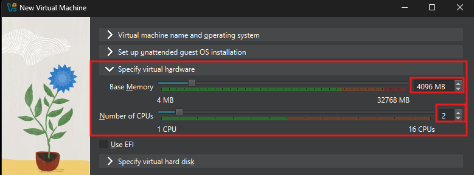
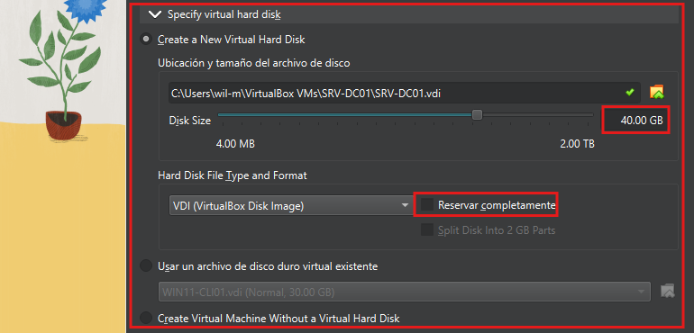
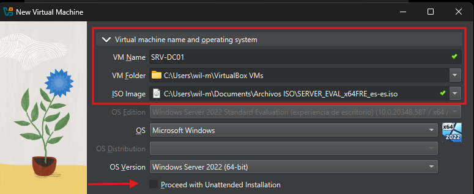

# Windows Server 2022
## Descripción
Implementación de un servidor Windows Server 2022 que actuará como núcleo de la infraestructura corporativa del laboratorio ASIR.
Este servidor será utilzado posteriormente para desplegar Active Directory, DNS, DHCP, carpetas compartidas NTFS, políticas de grupo y servicios de autenticación centralizado.

## Objetivos
- Implementar un servicio Windows Server 2022
- Prepar la infraestructura para Active Directory
- Configurar un entorno empresarial virtualizado
- Disponer de una plataforma centralizada para la administración de usuarios y equipos

## Tecnologías Utilizadas
- Oracle VirtualBox
- Windows Server 2022 Standard (Desktop Experience)
- Guest Addittions

### Configuración de Hardaware
- **Memoria RAM**     4 GB
- **CPU**             2 vCPU
- **Disco Virtual**   40 GB
- **Tipo de Disco**   VDI

### Instalación del Sistema Operativo
Se creó una nueva máquina virtual denominada _SRV-DC01_ utilizando Oracle VirtualBox.
Durante el proceso de instalación se seleccionó _Windows Server 2022 Satandard_

La Instalación se realizó de forma manual, ya que el modo desentendido presenta errores en la interfaz del asistente de instalación del Sistema Operativo.

